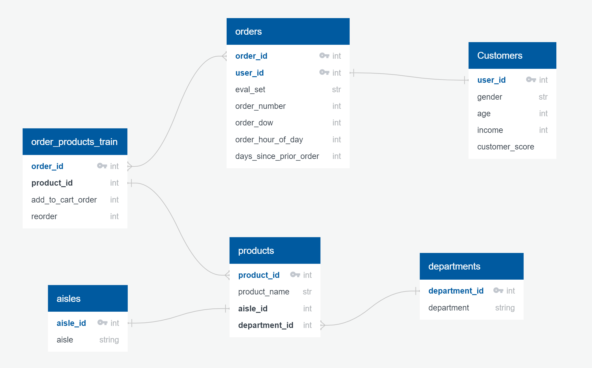

# Instacart Analysis

## Introduction
Instacart is an American Company that operates a grocery delivery and pick-up service in the United States and Canada. The service allows customers to order groceries from participating retailers with the shopping being done by a personal shopper.

During the COVID-19 lockdown, Instacart became an essential service for millions of Americans trapped at home. Even as early as February, Instacart started noticing unusual demand for items such as toilet paper, canned vegetables and long-life milk. 
Analysts expect sustained growth in this field as new Instacart users have discovered the ease of ordering online and now prefer shopping online even as Covid restrictions are being lifted.

Instacart reportedly generated $1.5 billion revenue in 2020, with $35 billion worth of sales. During the coronavirus pandemic, Instacart hit its first profitable month, netting $10 million. Instacart has an estimated 9.6 million active users and over 500,000 shoppers who pick up the items. In March 2021, Instacart was valued at $39 billion

## Objective

The dataset chosen for analysis comprises of about 3 million grocery orders placed by around 200,000 customers. The goal is to predict purchasing patterns among these customers as well as gain insight on customer segmentation.

### Market Basket Analysis:

-	Introduce new products in the market similar to the top selling products
- Introduce new products in the market similar to the top selling products by department
- Highlight the most popular vs least popular aisles across the store
- Plot order count vs reorder count by product
- To boost sales by providing discounts on products that are frequently purchased 
- To identify which products are least ordered or never re-ordered. With this analysis, the company would be able to reduce overhead costs incurred by carrying items that are less likely to be purchased
- Segment customers on their purchase frequency and recommend loyalty programs to each group of customers to increase sales.
- Which time of the day is the busiest for a particular product? A good understanding of this could help with the restocking time for the particular product.

### Customer Segmentation:
*  What is the distribution of annual Income by age?
*  What is the distribution of gender for Instacart users?
*  What is the age group of most frequent Instacart users
*  What is the overall distribution of income level for instacart users?
*  How do male and female spending scores differ? 

## Database

For this project we have chosen to use PostgreSQL to hold our database.

We currently have five related tables in our database, but that is expected to change as we begin to work with and transform our data. The database contains tables holding information on store aisles, departments, products in an order, orders, and available products.

Since the creation of the above ERD, the project has gained an additional dataset for customer segmentation - 'Customers.csv'. The dataset is already featured within the machine learning notebook and a new ERD will be updated in the next segment. 

For this project we created and AWS RDS instance connected to pgAdmin to store our database.  By using AWS we were able to ease the process of sharing the database amongst team members.

We have increased to six related tables containing data on aisles, departments, products in an order, orders, products, and customers.  

Six additional tables have been created to analyze the data. A table named customer_score_counts containing the number of customers in each customer score from 4 to 100. Tables containg the number of orders for each department, number of orders by gender, and number of orders and reorders by product have also been created. A table named user_reorder_counts has also been created.  This table bins users into ranges of 1-18 reorders, 18-35, 36-53, and 54-70 reorders and counts the number of users in each range to determine most users are in the lower ranges. 

## Machine Learning models
For our project, we will be using Unsupervised learning algorithms like K-means for customer segmentation and product segmentation. For Predictive analytics, we will be using deep learning Neural Networks. 
### K-Means for Customer Segmentation –
Our customers and Orders dataset would be merged for this analysis to group the customers into clusters based on characteristics of 
* Gender
* Age
* Income
* Customer_score
### K-Means for Product Segmentation –
We combined the products dataset with the prior orders dataset to get metrics such as **num_of_orders** and **num_of_reorders** per product. Also using product characteristics such as its department and the aisle it belongs to, we used K-Means algorithm to cluster the products into 4 main clusters –
-	Class 0 - never re-ordered.
-	Class 1 - occasionally re-ordered.
-	Class 2 - often re-ordered or **Popular**.
-	Class 3 - frequently re-ordered or **“In-High Demand”**.
### Predictive analysis using Deep learning Neural network models.
We used the prior orders dataset and joined with products, departments, and aisles to build our combined dataset used to train the Neural Network model.
Features:
-	order day of week (order_dow)
-	order hour of day (order_hour_of_day)
-	days since product was bought since prior order (days_since_prior_order)
-	order in which product was added to the cart (add_to_cart_order)
-	total number of re-orders for the product (num_of_reorders)
-	total number of orders for the product (num_of_orders)
-	product department (department)
-	product aisle (aisle)
- Target = **“reordered”**
We used pd.dummies for string  value features and scaled the dataset before training the model.
We received an accuracy of ~70.5% using multiple attempts, by altering the number of inputs, activation functions and the number of hidden layers and the number of epochs.

## Tableau Images

### Product Analysis:

#### Top N Products by Department

#### %Products Never Ordered by Aisle

#### Least Re-ordered Products

#### Market Basket Analysis

#### Order Volumes based on DOW and Time

#### Products Ordered together

### Customer Analysis

#### Analysis by Customer Age

#### Analysis by Gender

#### Analysis by Income

#### Orders by Age

#### Orders by Age and Gender

#### Spending Trends by Gender and Income

## Group Communication Protocols

The group members will remain in consistent contact through the Slack app and will hold meetings via Zoom throughout the week to discuss arising challenges, delgate tasks, and ensure the progress of the project.

## Presentation 
[Click Here to View Google Slide Presentation](https://docs.google.com/presentation/d/1Em1EJJ7RFDe6lQUdzrOOEO2_fN0sd_4-sNbsHl7Ewz4/edit#slide=id.g35f391192_00)

